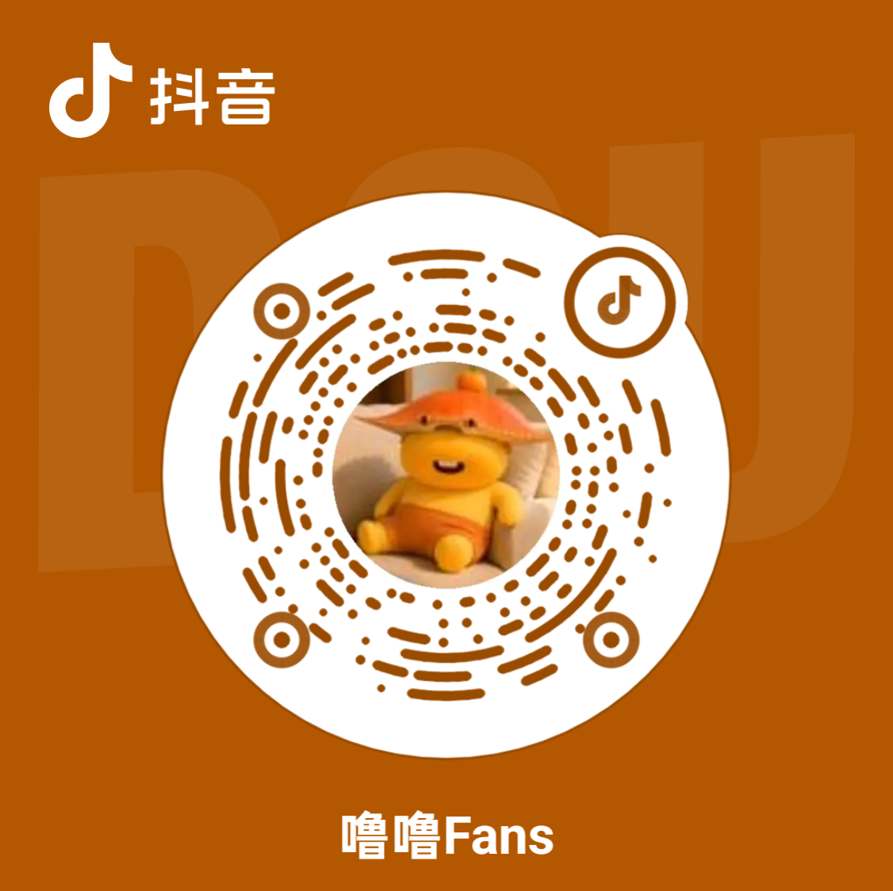

# 随它导航：Let It Go 
# 从何而来
每个程序员心里，都烧着一团开源的火。

2020年6月，我亲手把它摁灭了。不是不爱了，是怕了——怕熬不过中年危机，怕代码敲到三十五岁就没人要，怕梦想养不活自己。离开那天，我把GitHub头像换成灰色，像给什么东西立了座坟。

可那团火没死。它只是在暗处烧，烧得又慢又疼。

多年工作中，我收藏了许多个网站。每次点开那些精巧的页面，心里都有个声音在说：你看，别人做到了。你本也可以。

直到AI来了。

Vibe Coding，有人叫它“氛围编程”，有人说是“用嘴写代码”。但对我来说，它像一扇突然推开的门——门外站着曾经那个热血沸腾的自己，他问我：现在，敢不敢再试一次？

这一次，我点了头。
# 想做什么
我想把散落天涯的好东西，一件件捡回来。

那些让我惊叹过的网站，那些帮过我的工具，那些藏在大海深处的宝藏——我想把它们擦干净，摆整齐，放在一个所有人都能找到的地方。

不设墙，不收费，不藏私。

就纯粹地——因为我曾经需要，所以我知道你也需要。
# 到哪里去
这条路，我没打算一个人走。

收录一切值得被看见的资源。 原则很简单：免费最好，不免费也行，但免费的部分必须足够体面，体面到能让一个刚入门的新手，站着把路走通。

持续优化，持续开发。 让工具更好用，让界面更顺手，让每一次点击都不辜负期待。

最重要的是——欢迎你来提需求。

你开口，我烧Token。

烧完算数，下月再战😂。
# 关于名称
这个导航站，叫“随它导航”。

“随它”不是放弃，是放下——放下曾经的怯懦，放下对自己的怀疑，放下“等我准备好再说”的借口。

这一次，就让代码随它流淌，让梦想随它生长，让所有的“来不及”都随它去吧。

Let it go.

Let it be done.
# 项目速览
请访问：https://workmate.lulufans.online/
# 欢迎交流
