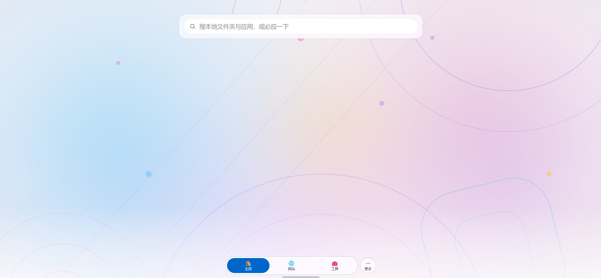
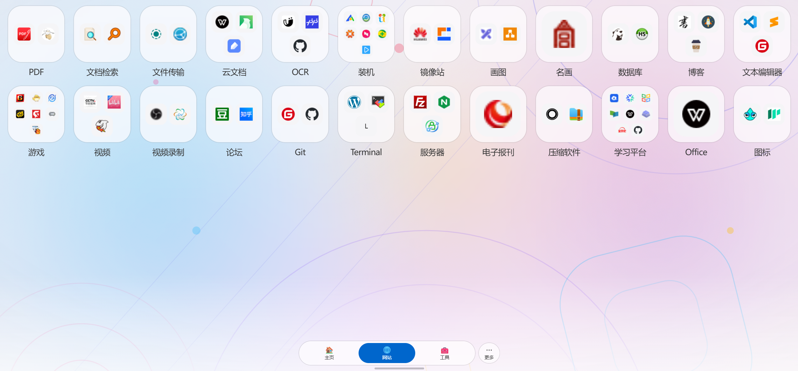
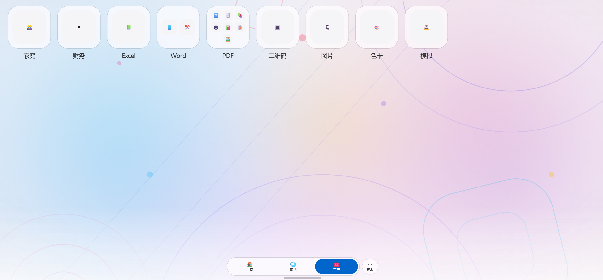

# Let It Go 随它导航
# 从何而来
每个程序员都有一个开源的梦想，我也不例外。做了三年程序员，焦虑和迷茫充斥着我的每一天。2020年6月转行，梦想藏在了心里。恰逢AI时代来临，Vibe Coding让我看到了完成梦想的曙光。
# 想做什么
工作中遇到了很多好用的软件，我想把他们整理记录分享。

新工作偏文字和后勤保障类，总有很多同事问我一些工具的问题，而我会在各个网站上找。既不安全，也不方便。我想把它们聚合到一处。

传统的导航网站移动端适配不友好，手机的UI天然适配手机，所以参考手机桌面设计了网站UI。

# 到哪里去
持续收录优秀的网站、软件、资源。收录原则：免费或不免费但免费的部分足够满足用户需求。

持续开发优化工具和网站界面。取决的免费的额度，当月额度用完了，当月开发停止😂
# 项目速览

